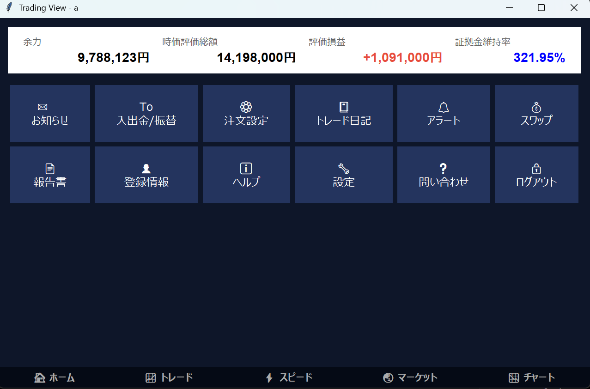
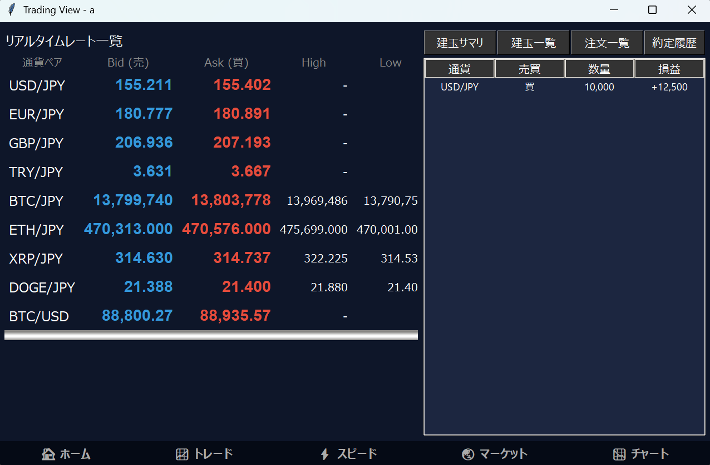
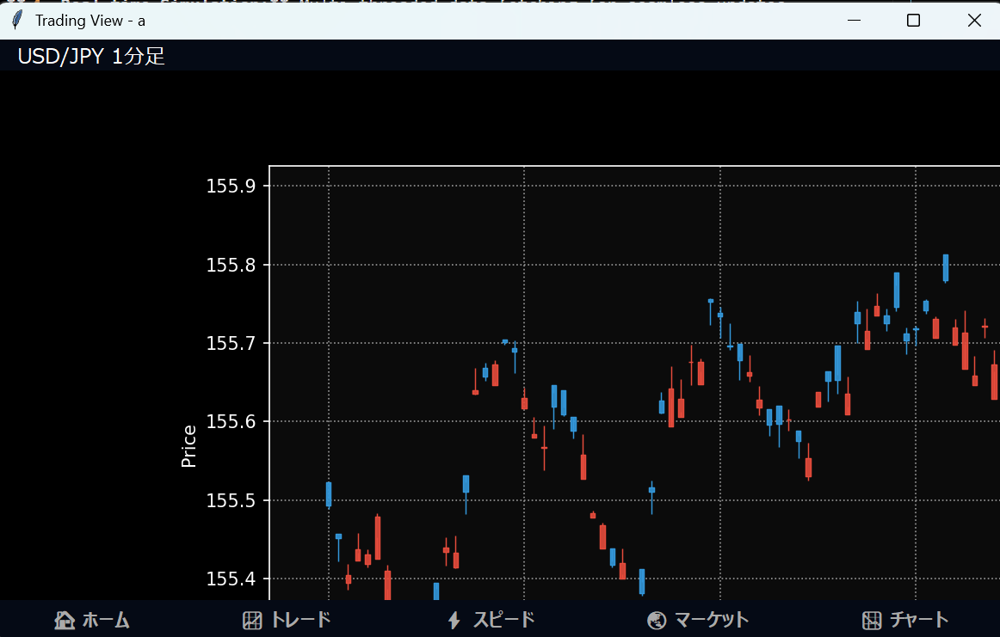
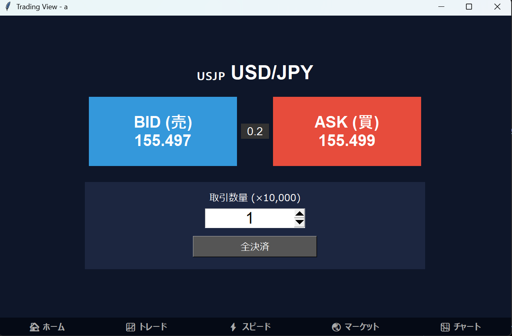

<div align="center">
  
  
  # GMO Click Style FX Simulator
  
  
  
  
  

  <br>
  <a href="#-overview">Overview</a> •
  <a href="#-features">Features</a> •
  <a href="#-demo">Demo</a> •
  <a href="#-installation">Installation</a> •
  <a href="#-author">Author</a>
  
  <br><br>
</div>

---

## 📖 Overview

**GMO Click Style FX Simulator** is a desktop trading application built with **Python** and **Tkinter**.
Designed to simulate the professional UI of Japanese securities platforms, featuring real-time rate updates, interactive charting, and high-performance rendering.

<div align="center">
  
</div>

---

## ✨ Features

* **📈 Professional UI:** Dark-mode interface inspired by real trading platforms.
* **⚡ Real-time Simulation:** Multi-threaded data fetching for seamless updates.
* **📊 Interactive Charts:** Candlestick charts powered by `mplfinance` with auto-resizing.
* **🛡️ Order System:** "Speed Order" interface for one-click trading simulation.

---

## 📸 Screenshots

| **Home View** | **Trade View** |
|:---:|:---:|
|  |  |

| **Chart Analysis** | **Speed Order** |
|:---:|:---:|
|  |  |

---

## 📦 Installation

```bash
# 1. Clone the repository
git clone [https://github.com/syxoxu/tradeSoft.git](https://github.com/syxoxu/tradeSoft.git)
cd tradeSoft

# 2. Install dependencies
pip install pandas numpy matplotlib mplfinance

# 3. Run the app
python main.py